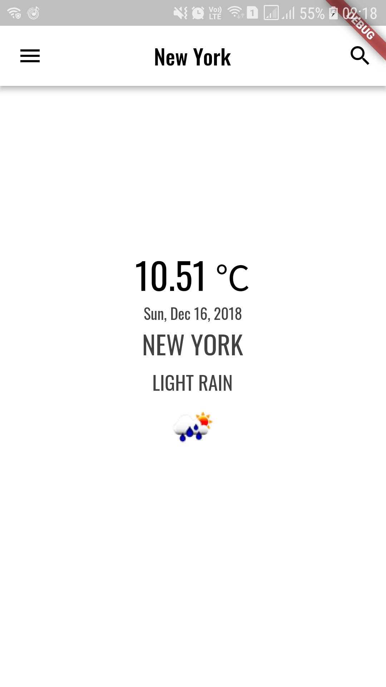

# Flutter Weather App

### :heart: Star :heart: the repo to support the project or :smile:[Follow Me](https://github.com/AyushBherwani1998).Thanks!

### You will learn: 
1 | 2 | 3 | 4 
--- | --- | --- | ---
Make HTTP request | Future | FutureBuilder | Some Basic Flutter Widget 

### API Used

OpenWeatherMap Current Weather Data API
Link:(https://openweathermap.org/api)

### ScreenShots
### 1

### 2

